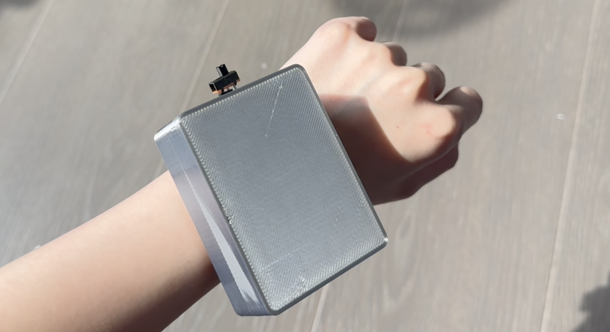
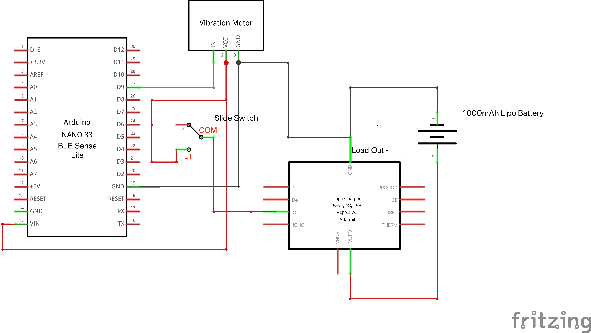
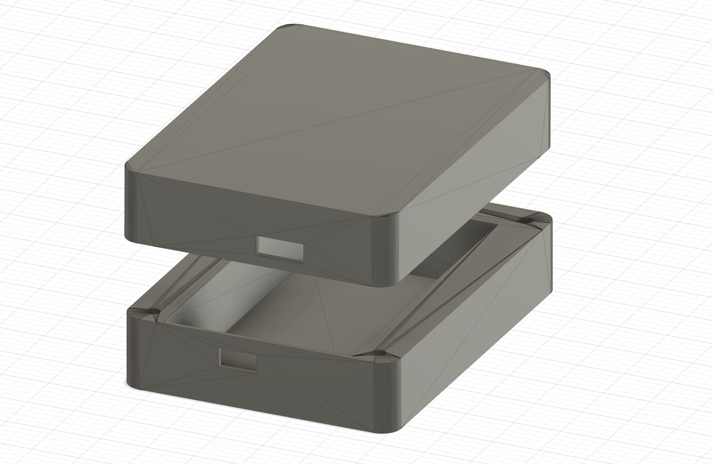

#  Emergency Sounds Classifier
**CASA0018 Deep Learning for Sensor Networks — Final Project**


A wearable wristband for deaf and hearing-impaired people that detects urban emergency sounds in real time and alerts the user through vibration patterns.

<p align="center">
  <br>
</p>

---

## Overview

Approximately 1.57 billion people worldwide experience some degree of hearing loss. In urban environments, this creates real safety risks: failing to detect approaching emergency vehicles or car horns affects both pedestrians and drivers. This project deploys a trained audio classification model on an Arduino Nano 33 BLE Sense Lite, embedded in a 3D-printed wristband. The device listens continuously through its onboard MEMS microphone and triggers different vibration patterns depending on what it hears.

**Three classes are detected:**

| Class | Alert |
|---|---|
| `siren_hilo` | 1800ms sustained vibration pulse |
| `siren_wail&yelp` | 1800ms sustained vibration pulse |
| `carhorn` | Two 400ms pulses with 200ms gap |
| `background` | No vibration |

A confidence threshold of 0.70 is applied — the motor only activates when the model is sufficiently certain.

---

## Hardware

| Component | Spec | Role |
|---|---|---|
| Arduino Nano 33 BLE Sense Lite | 3.7V operating, VIN 4.5–21V | Microphone input, model inference, motor control |
| Vibration Motor Module | 3V–5.3V | Haptic alert output |
| 1000mAh 3.7V LiPo Battery | Nominal 3.7V | Wireless power |
| Adafruit bq24074 Charger | Load output 3.7–4.2V | USB-C charging, power regulation |
| Slide Switch | 0.3A 50V | On/off control |

**Wiring summary:**
- LiPo → bq24074 BATT port
- bq24074 LOAD → Arduino VIN (via slide switch)
- Arduino 3.3V → Motor VCC
- Arduino GND → Motor GND
- Arduino D9 → Motor IN

<p align="center">
  <br>
  <sub>Device wiring schematic</sub>
</p>

**Estimated battery life:** ~83 hours assuming emergency sounds occur 10% of operating time (9mA idle, up to 39mA when motor fires).

---

## Enclosure

Hardware is housed in a custom 3D-printed box attached to a fabric scrunchy to simulate a wristband. The base is 1mm thick to maximise vibration transmission. Two rectangular apertures allow USB-C charging access and slide switch operation. Four corner screws secure the lid.

<p align="center">
  <br>
  <sub>Enclosure 3D model</sub>
</p>

---

## Model

**Platform:** Edge Impulse (TensorFlow-based)

**Feature extraction:** Mel-filterbank Energy (MFE) — chosen over MFCCs because MFCCs' cepstral compression discards higher-frequency spectral detail, which is important for siren frequency sweep patterns.

**Architecture:** 1D Convolutional Neural Network
- Input: 2000ms audio window, resampled to 16kHz
- Two 1D conv/pool layers (16 filters, kernel size 3)
- Two dropout layers (rate 0.25)
- Flatten → output layer (4 classes)

**Deployment:** Quantised int8 TensorFlow Lite Arduino library
- RAM: 35.8KB (well within Arduino's 256KB budget)
- Latency: 522ms
- No accuracy loss vs. float32

**Final test accuracy: 94.26%**

| Class | Test Accuracy | F1 Score |
|---|---|---|
| background | 94.1% | 0.94 |
| carhorn | 72.7% | 0.84 |
| siren_hilo | 98.8% | 0.99 |
| siren_wail&yelp | 99.6% | 0.97 |

AUC-ROC: 1.00

---

## Experiment Log

Eight experiments were run iteratively. Key findings:

| Experiment | Key Change | Validation Acc | Test Acc |
|---|---|---|---|
| 1 | Baseline, 6 classes | 98.3% | 33.68% |
| 2 | Removed problematic background recording | 98.4% | 69.73% |
| 3 | 4000ms window, adjusted MFE, removed phaser | 98.1% | 50.26% |
| 4 | Merged wail & yelp, reverted to 2000ms | 97.5% | 91.65% |
| 5 | Increased first conv filters 8 → 16 | 98.3% | 94.54% |
| 6 | Added street-recorded carhorn samples | 99.5% | 70.71% |
| 7 | Added diverse background (traffic, wind) | 97.2% | 74.12% |
| 8 | Added wind and ambience samples — **final model** | 98.7% | 94.26% |

The single largest accuracy gain (+40 percentage points) came from merging `siren_wail` and `siren_yelp` into one class in Experiment 4 — achieved purely through label redesign, with no change to architecture or training parameters.

---

## Data

Audio samples were collected from two sources:

- **Personal recordings** — primarily around central London
- **Freesound.org** — supplementary samples (see [`SampleData/ATTRIBUTIONS.md`](SampleData/ATTRIBUTIONS.md) for full attribution)

All audio was resampled from 44.1kHz to 16kHz to match the Arduino microphone's capture rate before feature extraction.

**Class structure evolved across experiments** — starting with 6 classes (`background`, `carhorn`, `siren_hilo`, `siren_wail`, `siren_yelp`, `siren_phaser`) and consolidating to 4 by the final model. `siren_phaser` was removed due to insufficient data; `siren_wail` and `siren_yelp` were merged because they are acoustically inseparable at any tested window size and require the same user response.

---

## Repository Structure

```
├── Enclosure/
│   └── Bottom.STL                 # Enclosure bottom part
│   └── Top.STL                    # Enclosure top part
├── Siren_Classification/
│   └── Siren_Classification.ino   # Arduino sketch (inference + vibration logic)
├── SampleData/
│   └── ATTRIBUTIONS.md            # Full Freesound sample attribution
│   └── BackgroundNoise/
│   └── CarHorn/ 
│   └── Sirens/
│       └── Yelp/
│       └── Wail/
│       └── Hi-Lo/
│       └── Phaser/
├── model/
│   └── ei-emergencyvehiclesirens-arduino-1.0.1-impulse-6.zip  # Trained model
└── README.md
```

---

## How to Reproduce

1. **Set up Edge Impulse project** — create a new project and select Arduino Nano 33 BLE Sense as the target device
2. **Upload audio data** — use the Edge Impulse data acquisition tool or upload files directly; resample to 16kHz
3. **Configure impulse** — set window size to 2000ms; select MFE feature extraction with default parameters (frame length 0.02, frame stride 0.01, 40 filters, FFT length 256, noise floor −52dB)
4. **Set neural network architecture** — two 1D conv/pool layers with 16 filters, kernel size 3; dropout 0.25 after each; flatten; 4-class output
5. **Train and test** — target ~73/27 train/test split
6. **Deploy** — export as quantised int8 Arduino library
7. **Flash the sketch** — open `Siren_Classification/Siren_Classification.ino` in Arduino IDE, install the exported library, and upload to the board

---

## Limitations and Future Work

- **Carhorn false negatives (23.4%)** — a short horn in heavy traffic can produce a feature map acoustically similar to road ambience. A larger and more diverse carhorn dataset, particularly distant and overlapping sounds, would address this.
- **Enclosure attenuation** — testing showed that enclosing the device on the wrist reduces microphone sensitivity to distant sounds compared to open-air conditions. Aperture placement or microphone relocation could improve this.
- **Validation vs. test gap** — in experiments 6–7, high validation accuracy was misleading because validation samples did not reflect real-world recording conditions. The held-out test set is the only reliable performance indicator for this type of project.

---

## References

- Bubar et al. (2020). Emergency siren detection technology and hearing impairment: a systematized literature review. *Disability and Rehabilitation: Assistive Technology*.
- Chemnad & Othman (2024). Digital accessibility in the era of artificial intelligence. *Frontiers in Artificial Intelligence*.
- Haile et al. (2021). Hearing loss prevalence and years lived with disability, 1990–2019. *The Lancet*, 397(10278).
- Haytham Fayek (2016). *Speech Processing for Machine Learning: Filter banks, Mel-Frequency Cepstral Coefficients (MFCCs) and What’s In-Between*. 

- Fayek, H. (2016). Speech Processing for Machine Learning: Filter banks, MFCCs and What's In-Between.
- Luque et al. (2018). Optimal Representation of Anuran Call Spectrum in Environmental Monitoring Systems. *Sensors*, 18(6).
- Zayen & Groessing (2025). SafeDrive4Deaf. *Nafath*, 9(29).

---

## Generative AI Disclosure

Claude (Anthropic, Sonnet 4.6) was used during this project for research framing, technical guidance on Edge Impulse and wiring decisions, and report writing assistance. All experimental decisions, data collection, and results are the author's own work. All AI-assisted content was reviewed and verified before inclusion.
